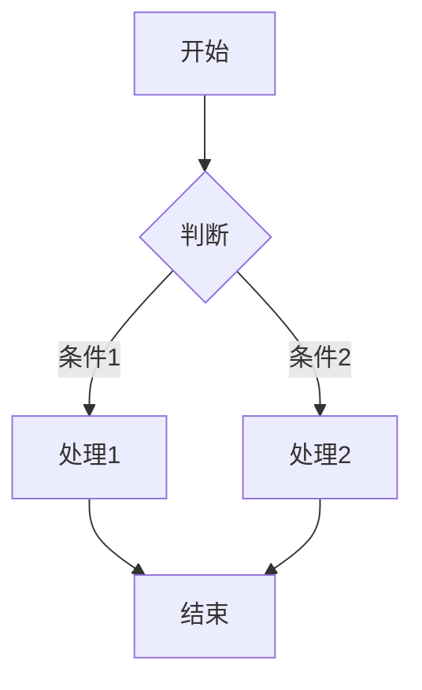

# 更新日志 Changelog

## [0.1.3] - 2026-05-01

### ✨ 新特性 New Features

#### 1. Mermaid 图表支持 Mermaid Diagram Support

**markconv 0.1.3 版本开始，HTML 和 PDF 导出均支持 Mermaid 图表渲染！**

**Starting from markconv 0.1.3, both HTML and PDF exports support Mermaid diagram rendering!**

您现在可以在 Markdown 文件中直接编写 Mermaid 图表代码，转换后会自动渲染为图表：

You can now write Mermaid diagram code directly in Markdown files, and it will be automatically rendered as diagrams after conversion:

```markdown

```

支持的图表类型 Supported chart types:
- 流程图 Flowchart (`graph TD`, `graph LR`)
- 时序图 Sequence Diagram (`sequenceDiagram`)
- 类图 Class Diagram (`classDiagram`)
- 状态图 State Diagram (`stateDiagram`)
- 实体关系图 ER Diagram (`erDiagram`)
- 甘特图 Gantt Chart (`gantt`)
- 饼图 Pie Chart (`pie`)
- 用户旅程图 User Journey (`journey`)

### 🎨 样式特性 Styling Features

#### 1. 透明背景 Transparent Background

Mermaid 图表默认使用**透明背景**，方便您在 HTML/PDF 中自定义背景色。

Mermaid diagrams use **transparent background** by default, making it easy to customize background colors in HTML/PDF.

#### 2. 水平居中 Center Alignment

所有 Mermaid 图表在输出时会自动**水平居中**显示。

All Mermaid diagrams are automatically **center-aligned** in the output.

#### 3. 自定义背景色 Custom Background Color

如需自定义图表背景色，可以修改 `MermaidProcessor` 的 `background_color` 参数：

To customize the chart background color, modify the `background_color` parameter of `MermaidProcessor`:

```python
from markconv.tools import MermaidProcessor

# 使用白色背景 Use white background
processor = MermaidProcessor(
    output_dir='./images',
    background_color='white'  # 或 '#FFFFFF'
)
```

### 📄 使用示例 Usage Examples

#### PDF 导出示例 PDF Export Example

```python
from markconv import MDConverter

# 创建转换器实例
converter = MDConverter()

# 转换为 PDF（自动渲染 Mermaid 图表）
converter.to_pdf('input.md', 'output.pdf')
```

#### HTML 导出示例 HTML Export Example

```python
from markconv import MDConverter

# 创建转换器实例
converter = MDConverter()

# 转换为 HTML（自动渲染 Mermaid 图表）
converter.to_html('input.md', 'output.html')
```

### 🔧 技术实现 Technical Implementation

- 使用 `mermaid-cli` 库渲染 Mermaid 图表
- 图表渲染为 PNG 图片后嵌入到 HTML/PDF 中
- PDF 生成后自动清理临时图片文件
- 支持透明背景和自定义背景色

### 📦 依赖更新 Dependency Updates

新增依赖 Added dependencies:
- `mermaid-cli>=0.1.3` - 用于渲染 Mermaid 图表

---

## [0.1.2] - 早期版本 Earlier Versions

- 基础 Markdown 转 HTML/PDF 功能
- 支持自定义 CSS 样式
- 支持中文内容
