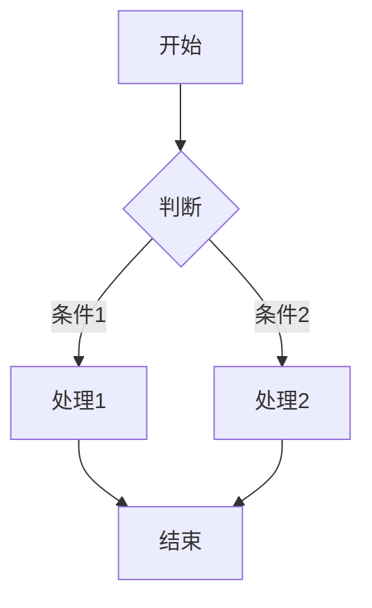
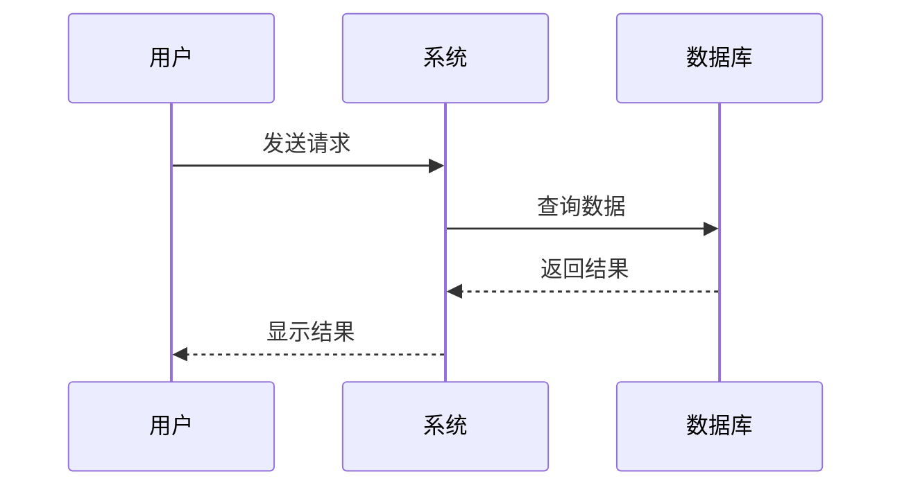
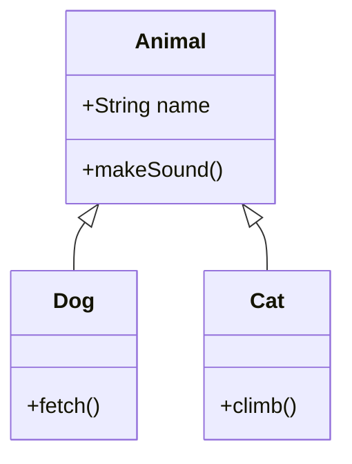
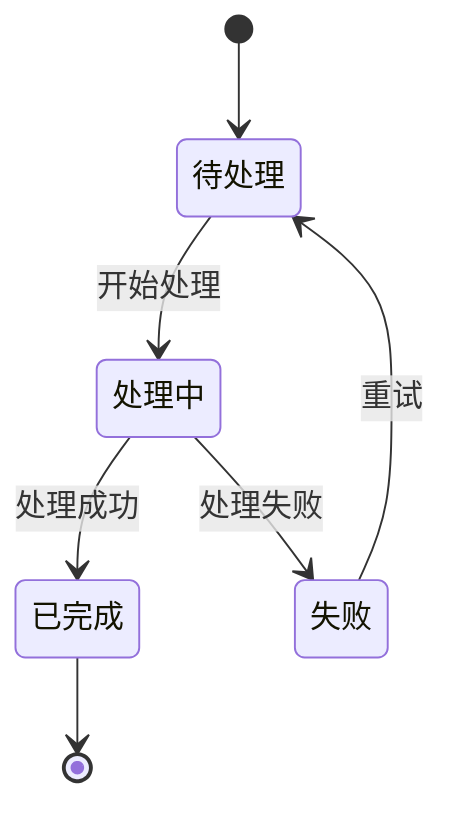
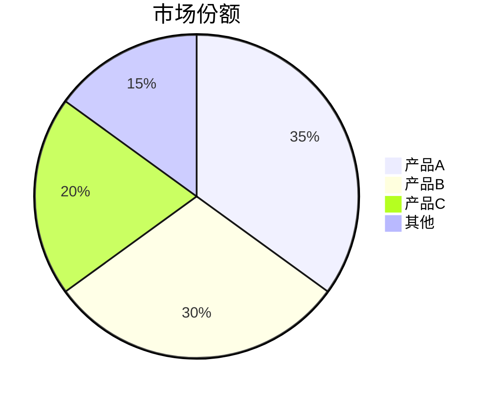
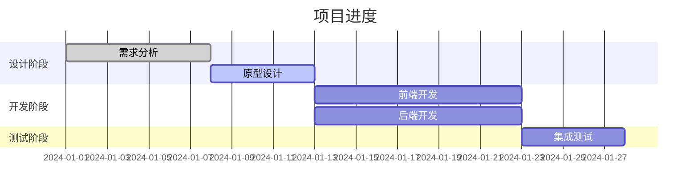
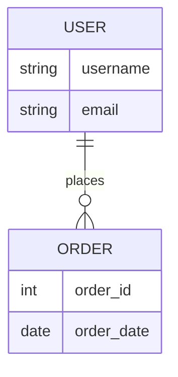
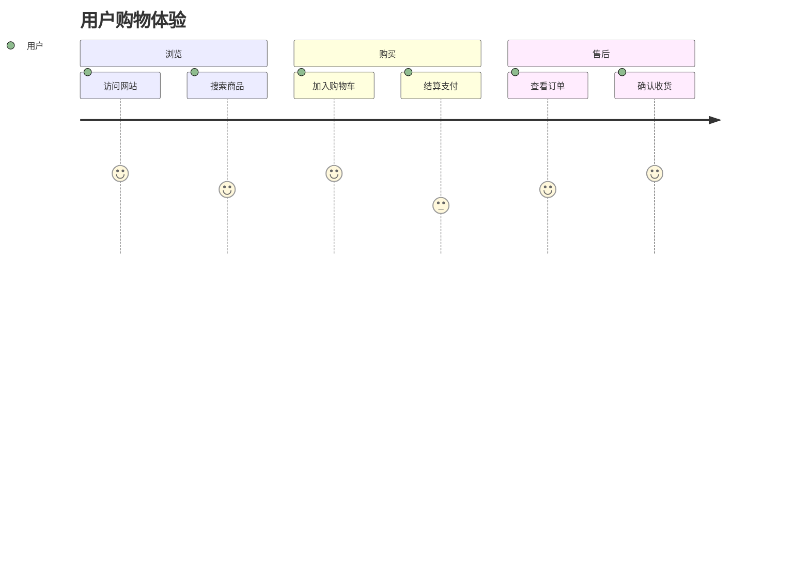

# Mermaid 图表示例文档

本文档演示各种 Mermaid 图表的使用方法。

## 1. 流程图 Flowchart

## 2. 时序图 Sequence Diagram

## 3. 类图 Class Diagram

## 4. 状态图 State Diagram

## 5. 饼图 Pie Chart

## 6. 甘特图 Gantt Chart

## 7. 实体关系图 ER Diagram

## 8. 用户旅程图 User Journey

